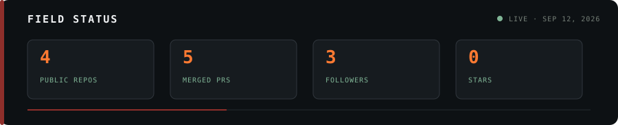

**English** · [Português](README.pt-BR.md) · [Español](README.es.md)

# Guilherme Hellman

Software developer specializing in C++, Unreal Engine, AI-assisted engineering and information security. I use Codex and Claude Code to design, build, test and deliver complete systems.

`HEL` &nbsp; `PANTANAL` &nbsp; `DRONE SOFTWARE`

## Selected work

| HEL | Pantanal | Drone software |
|---|---|---|
| Extraction survival built in Unreal Engine. Gameplay, combat, locomotion and character architecture developed in-house in C++. | RedM world with farms, animal genetics, cooperatives, industries, currency and exports. Includes dashboards and player guides. | Control, automation, telemetry and operational systems built for real drone workflows. |

### Dronner

A small endless runner made with HTML, Canvas and original illustrated assets.

**[Play Dronner](https://hellmangui.github.io/dronner/)** · [Source](https://github.com/hellmangui/dronner)

## Expertise

| | |
|---|---|
| **AI engineering** | Codex · Claude Code · agents · automation · end-to-end development |
| **Information security** | Pentesting · vulnerability analysis · security testing |
| **Game systems** | Unreal Engine 5 · C++ · Blueprints · Lua · gameplay · RedM / FiveM |
| **Drone systems** | Control · telemetry · automation · operational software |
| **Web** | Python · TypeScript · Next.js · React · Tailwind · PostgreSQL · Supabase |
| **Design** | Photoshop · Illustrator · After Effects · DaVinci Resolve · Blender · Cinema 4D |

Most game and drone work is kept in private repositories.

[Achievements](https://github.com/hellmangui?tab=achievements) · Portuguese, Spanish and English
